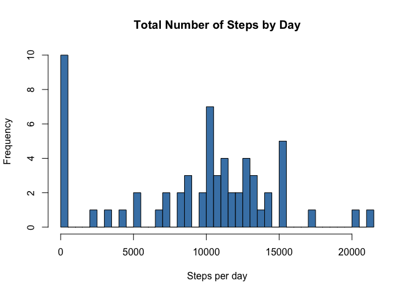
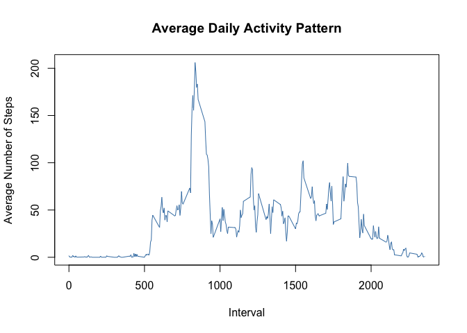
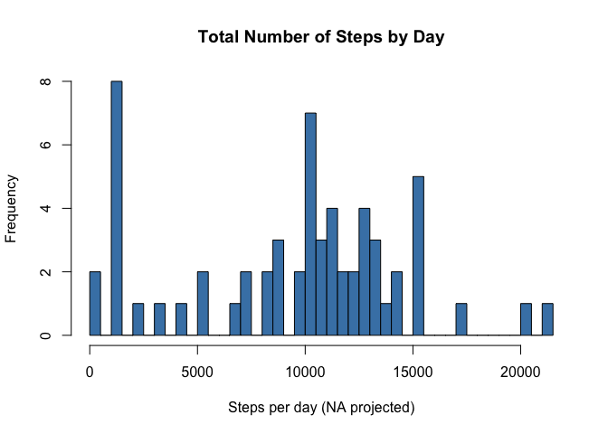
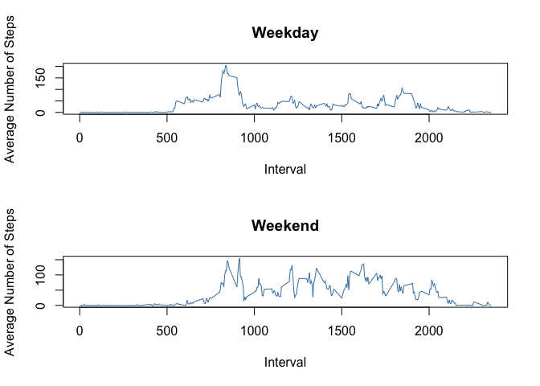

# Reproducible Research: Peer Assessment 1
Written by: Kenneth D. Graves

This assignment is part of Coursera's Data Science's Reproducible Rearch assignment. It is study of personal activity monitoring using devices such as a Fitbit, Nike Fuelband, or Jawbone Up. The data consists of two months of readings from an anonymous individual collected during the months of October and November, 2012 and include the number of steps taken in 5 minute intervals each day.

The variables included in this dataset are:

* steps: Number of steps taking in a 5-minute interval (missing values are coded as NA)

* date: The date on which the measurement was taken in YYYY-MM-DD format

* interval: Identifier for the 5-minute interval in which measurement was taken

The dataset is stored in a comma-separated-value (CSV) file and there are a total of 17,568 observations in this dataset.

## Loading and preprocessing the data

```r
if (!file.exists("./data")) {
        dir.create("./data")
}
if (!file.exists("./activity.zip")) {
    fileURL <- "https://d396qusza40orc.cloudfront.net/repdata%2Fdata%2Factivity.zip"
    download.file(fileURL,destfile = "./activity.zip",method = "curl")
}
if (!file.exists("./data/activity.csv")) {
    unzip("./activity.zip",overwrite = TRUE,exdir = "./data")
}
activity <- read.csv("./data/activity.csv", stringsAsFactors=FALSE)
activity$date <- as.Date(activity$date,format = "%Y-%m-%d")
```

## What is mean total number of steps taken per day?

```r
day_steps <- tapply(activity$steps, activity$date, FUN = sum, na.rm=TRUE)
hist(day_steps, breaks = length(day_steps), xlab = "Steps per day", main = "Total Number of Steps by Day", col = "steelblue")
```

 

```r
mu_total <- round(mean(day_steps, na.rm = TRUE),1)
median_total <- median(day_steps, na.rm = TRUE)
```
The mean total number of steps per day is 9354.2 and the median total number of steps per day is 10395.

## What is the average daily activity pattern?

```r
library("plyr")
interval_steps <- ddply(activity,~interval, summarize, avg = mean(steps, na.rm = TRUE))
plot(x = interval_steps$interval, 
     y = interval_steps$avg, 
     type = "l", 
     col = "steelblue",
     main = "Average Daily Activity Pattern",
     xlab = "Interval",
     ylab = "Average Number of Steps"
)
```

 

```r
mu_interval <- interval_steps$interval[which.max(interval_steps$avg)]
```
Which 5-minute interval, on average across all the days in the dataset, contains the maximum number of steps?

```r
max_interval <- interval_steps$interval[which.max(interval_steps$avg)]
```
Interval with maximum number of steps: 835.

## Imputing missing values

```r
na_sum <- sum(is.na(activity))
```
Total number of missing values in the dataset: 2304.
Devise a strategy for filling in all of the missing values in the dataset.

```r
day_mean <- ddply(activity, ~interval, summarize, med = median(steps, na.rm = TRUE))
activity2 <- activity
for (i in 1:nrow(activity2)) {
    if (is.na(activity2$steps[i])) {
        foo <- day_mean$interval == activity2$interval[i];
        activity2$steps[i] <- day_mean$med[foo]
    }
}
```
Make a histogram of the total number of steps taken each day and Calculate and report the mean and median total number of steps taken per day.

```r
day_steps2 <- tapply(activity2$steps, activity2$date, FUN = sum, na.rm=TRUE)
hist(day_steps2, breaks = length(day_steps2), xlab = "Steps per day (NA projected)", main = "Total Number of Steps by Day", col = "steelblue")
```

 

```r
mu_total2 <- round(mean(day_steps2, na.rm = TRUE),1)
median_total2 <- median(day_steps2, na.rm = TRUE)
mu_diff <- mu_total2 - mu_total
```
The mean total with imputed values is 9503.9 and the median is 10395.  Though the median remains stable, the mean is increased by 149.7.


## Are there differences in activity patterns between weekdays and weekends?
Create a new factor variable in the dataset with two levels -- "weekday" and "weekend" indicating whether a given date is a weekday or weekend day.

```r
weekpart <- c("Weekday","Weekend")
assign_part <- function(date) {
    day <- weekdays(date)
    part <- factor("Weekday",weekpart)
    
    if (day %in% c("Saturday","Sunday")) {
        part <- factor("Weekend",weekpart)
    }
    return(as.factor(part))
}
activity2$weekpart <- sapply(activity2$date,assign_part)
```
Make a panel plot containing a time series plot using simulated data. There does indeed appear to be differences in activity between weekday and weekend.

```r
totals <- ddply(activity2,.(weekpart,interval), summarize, avg = mean(steps, na.rm= TRUE))

par(mfrow = c(2,1))
plot(x = totals[totals$weekpart=="Weekday",]$interval, 
     y = totals[totals$weekpart=="Weekday",]$avg, 
     type = "l",
     col = "steelblue",
     xlab = "Interval", 
     ylab ="Average Number of Steps", 
     main = "Weekday"
     )
plot(x = totals[totals$weekpart=="Weekend",]$interval, 
     y = totals[totals$weekpart=="Weekend",]$avg, 
     type = "l",
     col = "steelblue",
     xlab = "Interval", 
     ylab ="Average Number of Steps", 
     main = "Weekend"
     )
```

 
